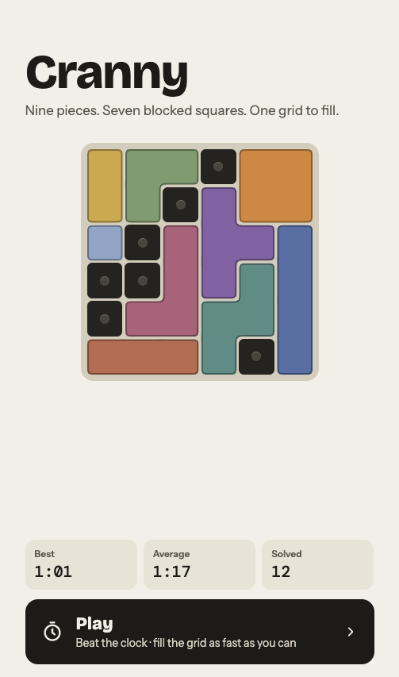
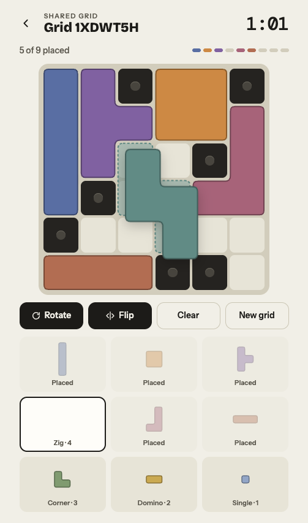
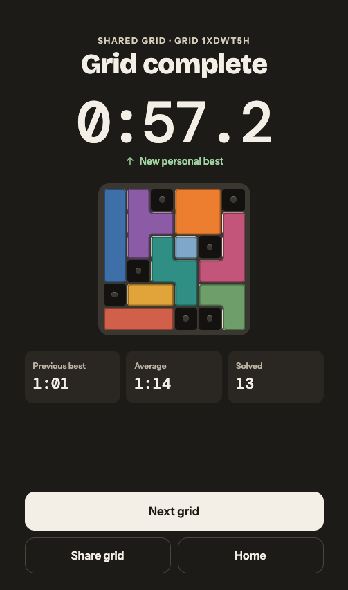

# Cranny

**Nine pieces. Seven blocked squares. One grid to fill.**

Cranny is a quick brain-teaser for your phone or browser. Each grid is a 6×6 board with seven blocked squares. Drag nine block pieces into every nook and cranny until the board is full, as fast as you can.

**[Play Cranny → cranny.cooke.ing](https://cranny.cooke.ing)**

<p align="center">
  
  
  
</p>

## How to play

- Press **Start** to reveal the blocked squares. The clock starts at the same moment.
- **Drag** pieces from the tray onto the board. A tinted outline shows where a piece will land. The outline turns red if the piece won't fit there.
- **Tap** a piece in the tray to select it, then use **Rotate** and **Flip** to turn it.
- Drag a placed piece to move it, or drag it off the board to put it back. **Clear** returns every piece to the tray.
- The nine pieces cover exactly the 29 open squares, so every grid can be filled. Every grid is checked by a solver before you see it.
- Fill the grid to stop the clock. Your best time, average and number of solved grids are kept on your device.
- **Share grid** sends a link to the exact same grid, so friends can try to beat your time.

The pieces are five four-square blocks (Long bar, Square, Tee, Zig and Ell), two three-square blocks (Bar and Corner), a Domino and a Single.

## Running it locally

You'll need Node 24 (see `.nvmrc`) and pnpm 12.

```bash
pnpm install
pnpm dev          # http://localhost:5173
```

Other useful commands:

| Command                              | What it does                                                               |
| ------------------------------------ | -------------------------------------------------------------------------- |
| `pnpm test`                          | Runs the engine and web app tests                                          |
| `pnpm lint` / `pnpm typecheck`       | Runs ESLint / TypeScript across the workspace                              |
| `pnpm build`                         | Builds the web app into `apps/web/dist`                                    |
| `pnpm --filter @cranny/web preview`  | Serves the build with the production security headers (after `pnpm build`) |
| `pnpm --filter @cranny/engine bench` | Times the grid solver against its budget                                   |

In development, add `?solve` to a grid URL (for example `/g/1XDWT5H?solve`). The grid then starts one drop from complete, which is handy for testing the finish.

The repository is a pnpm workspace:

- **`packages/engine`** is the game rules in pure TypeScript: pieces, the solver, the seeded grid generator and grid codes.
- **`apps/web`** is the React app.
- **`infra`** is the Terraform for hosting.

The [single-player spec](specs/2026-09-25-single-player/SPEC.md) has the full design and its [task list](specs/2026-09-25-single-player/TASKS.md) the build plan.

## Deploying

The site is a static build hosted on AWS:

- a private S3 bucket (eu-west-2)
- served by CloudFront with security headers
- an ACM certificate (us-east-1)
- Route 53 records in the existing `cooke.ing` hosted zone

Everything is defined in [`infra/`](infra/) and deployed by hand from a developer machine.

### What you need

- Terraform 1.10 or newer and AWS CLI v2. On a Mac: `brew install hashicorp/tap/terraform awscli`.
- AWS credentials for the account, for example from `aws login`. Check them with `aws sts get-caller-identity`. Use an IAM user or role with admin rights rather than the root user.
- The `cooke.ing` hosted zone in that account's Route 53.

### One-time setup

**1. Create the Terraform state bucket.** A small separate configuration creates the S3 bucket that holds Terraform's state. It keeps its own state locally, in `infra/bootstrap/terraform.tfstate`, which is git-ignored. That's fine, because it only manages that one bucket.

```bash
terraform -chdir=infra/bootstrap init
terraform -chdir=infra/bootstrap apply
terraform -chdir=infra/bootstrap output -raw backend_config > infra/backend.hcl
```

`infra/backend.hcl` is git-ignored because the bucket name contains the AWS account ID. On a fresh clone, where the bucket already exists, copy [`infra/backend.hcl.example`](infra/backend.hcl.example) to `infra/backend.hcl` and fill in the account ID.

**2. Create the hosting.**

```bash
terraform -chdir=infra init -backend-config=backend.hcl
terraform -chdir=infra plan
terraform -chdir=infra apply
```

The first apply takes around 5 to 15 minutes, mostly waiting for the certificate and for CloudFront to go live. It creates:

- the site bucket
- the CloudFront distribution and its security headers policy
- the certificate
- the DNS records for `cranny.cooke.ing`

### Deploying a new version

Commit your changes, then run:

```bash
scripts/deploy.sh
```

The script:

1. Refuses to run with uncommitted changes, shows which AWS identity it's using, and refuses the root user. Set `CRANNY_ALLOW_ROOT=1` if you really need to deploy as root.
2. Installs from the lockfile, then runs lint, typecheck and tests, and builds.
3. Uploads the hashed files in `assets/` first, cached for a year, then `index.html` with `no-cache`, so a new version appears straight away.
4. Clears CloudFront's cache.

Check the release with:

```bash
curl -sI https://cranny.cooke.ing/g/1XDWT5H   # expect 200, no-cache, and the security headers
```

### Changing the infrastructure

- **Terraform:** edit `infra/*.tf`, then `terraform -chdir=infra plan` and `apply`.
- **Security headers:** these (CSP, HSTS, nosniff, Referrer-Policy) live in [`apps/web/security-headers.json`](apps/web/security-headers.json). Both CloudFront and `pnpm preview` read that file, so you can test a policy change locally against the production build before applying it. The plan fails if the file gains a header that CloudFront isn't set up to send.
